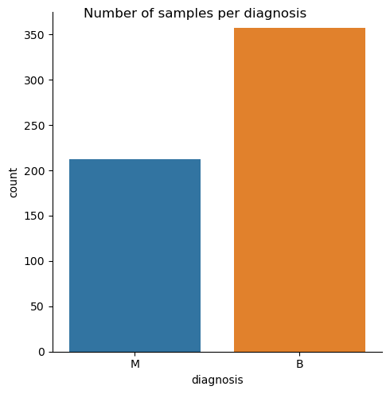
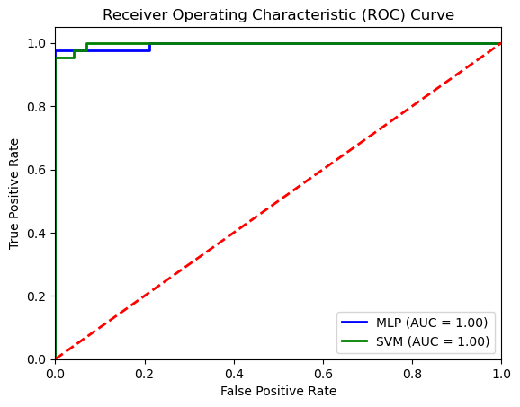

# Breast Cancer Classification: MLP vs SVM Comparative Study

## Introduction
This project presents a comparative study between two popular machine learning models: Multi-Layer Perceptron (MLP) and Support Vector Machine (SVM). The study aims to evaluate the performance of these models in classifying breast cancer cases using the Wisconsin Diagnostic Breast Cancer (WDBC) dataset. Given the critical nature of accurate breast cancer diagnosis, this study provides insights into the strengths and weaknesses of each model, considering class imbalance and other challenges.

## Dataset
The Wisconsin Diagnostic Breast Cancer (WDBC) dataset was used for this analysis. The dataset contains 569 samples, each representing a patient diagnosed with either a benign or malignant breast tumor. The dataset includes 30 features that describe the characteristics of the tumor, such as size, texture, and symmetry.

## Model Development and Analysis
### Multi-Layer Perceptron (MLP)
MLP is a type of artificial neural network consisting of multiple layers of interconnected nodes. In this project, the MLP model was designed with three hidden layers, each containing 100 neurons, and the ReLU activation function was used.

### Support Vector Machine (SVM)
SVM is a supervised learning algorithm that identifies the optimal separating hyperplane between data classes. For this study, the SVM model was optimized using a radial basis function (RBF) kernel, which was found to be the most effective.

## Performance Evaluation
The models were evaluated using several performance metrics, including accuracy, AUC-ROC, confusion matrix, F1 score, and precision. Below are some key results from the study:

### Confusion Matrix
The confusion matrices for both models were analyzed to understand their performance in classifying benign and malignant cases.

### Distribution of Samples by Diagnosis
The distribution of samples in the dataset shows a class imbalance, with more benign cases than malignant ones.

### ROC Curve
The ROC curves for both models demonstrated high classification performance, with both models achieving an AUC of 1.00.

## Results and Discussion
Both the MLP and SVM models showed high accuracy in classifying breast cancer cases, with the MLP model slightly outperforming the SVM model in terms of accuracy and F1 score. The results suggest that both models are well-suited for this task, but further validation on different datasets is recommended to ensure the robustness of these findings.

## Conclusion
This study demonstrates the effectiveness of MLP and SVM models in breast cancer classification, with both models achieving high performance metrics. However, due to the class imbalance in the dataset, additional evaluation using alternative datasets and metrics is recommended for a more comprehensive assessment.

## How to Run the Project
1. Clone the repository.
2. Ensure you have Python and Jupyter Notebook installed.
3. Open the provided Jupyter Notebook (`Neural Computing Coursework.ipynb`) to run the analysis.

## Dependencies
- Python 3.x
- NumPy
- Pandas
- Matplotlib
- Scikit-learn

## References
- UCI Machine Learning Repository: [Wisconsin Diagnostic Breast Cancer (WDBC) Dataset](http://archive.ics.uci.edu/ml/datasets/Breast+Cancer+Wisconsin+(Diagnostic))
- Additional references as cited in the project documentation.
